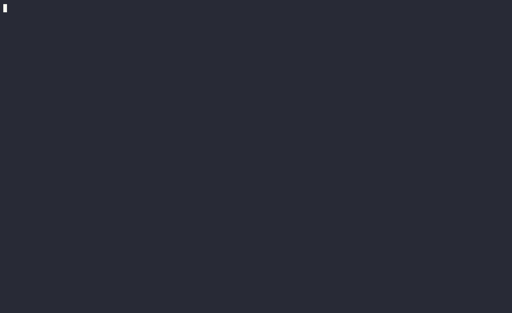

# Pitch
Highlight the opening and closing symbols of the blocks your cursor is currently in.


# Lineage
Cherry's ancestors are:

[https://github.com/tsdh/highlight-parentheses.el](highlight-parentheses.el) - Inital plugin for emacs

[https://github.com/bounceme/poppy.vim](poppy.vim) - Ported to vim

[https://github.com/G4bbix/opium.vim](opium.vim) - Added symbols longer than 1 character

[https://github.com/G4bbix/cherry_nvim/](cherry_nvim) - Nvim Port using treesitter instead of syntax. Much better performance

# Setup

## Lazy
```
require("lazy").setup({
  { "G4bbix/cherry_nvim" }
}
```

## Configuration

### Colors
```
require("cherry").setup({
  highlights = {
    { guibg = "#ea6962", guifg = "#1d2021", gui = "bold" },
    { guibg = "#e78a4e", guifg = "#1d2021", gui = "bold" },
    { guibg = "#d8a657", guifg = "#1d2021", gui = "bold" },
    { guibg = "#a9b665", guifg = "#1d2021", gui = "bold" },
    { guibg = "#89b482", guifg = "#1d2021", gui = "bold" },
    { guibg = "#d3869b", guifg = "#1d2021", gui = "bold" },
    { guibg = "#7daea3", guifg = "#1d2021", gui = "bold" },
    { guibg = "#d4be98", guifg = "#1d2021", gui = "bold" }
  },
})

```
### Custom pairs
```
require("cherry").setup({
  languages = {
    lua = {
      pairs = {
        { "<", ">" },
        { "function", ">" }
      }
    }
  }
})
```

### Autocmd
```
vim.api.nvim_create_autocmd({ 'CursorMoved', 'CursorMovedI' }, {
  pattern = "*",
  callback = function() require("cherry").update_pairs() end
})
```


# Contributions 
You may create a PR if you'd like to add pairs for any language that isn't included yet. 
